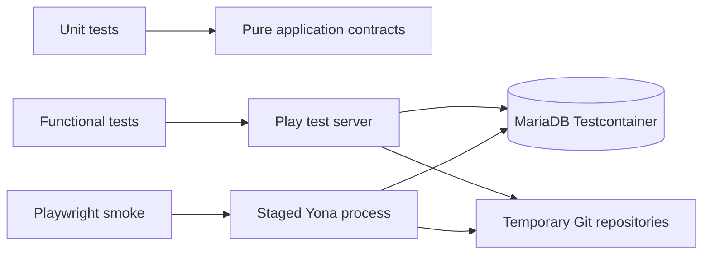

# Play 3 Stabilization and Test Rebuild Design

**Status:** Approved design

## Goal

Make the Play 3 / Java 21 port releasable by fixing the production regressions
found during end-to-end verification, and replace the unusable Play 2-era test
suite with a focused unit, functional, and browser smoke test system.

## Context

The application compiles on Java 21 and runs from sbt with MariaDB, but the
packaged `stage` application does not start. The existing 77 test sources no
longer compile after the Play 3 migration because they depend on Play 2 test
APIs and obsolete assertion/mocking libraries. Manual verification also found
failures in Smart HTTP Git push, favorites, mention punctuation, and ordinary
clipboard pasting in comments.

## Scope

### Stabilization work

1. Start the staged production artifact with a valid Play 3 security key,
   compatible logging configuration, and an Ebean-compatible logger classpath.
2. Restore Git Smart HTTP fetch and push while keeping authentication and
   project authorization intact.
3. Make project favorites idempotent and safe against duplicate browser events
   and concurrent requests. Anonymous favorite reads must return an empty
   result instead of failing.
4. Render user and project mentions correctly when followed by punctuation.
5. Make normal text clipboard pastes harmless when an attachment input is not
   present, while preserving image paste uploads.

### Test rebuild work

1. Remove every existing test source under `test/` and all obsolete test-only
   dependencies that support those tests.
2. Introduce new unit tests, database-backed functional tests, and small
   browser smoke tests.
3. Cover the regressions above and the existing user-critical flows:
   authentication, project collaboration, notifications, email mock delivery,
   MCP read access, and Git Smart HTTP.
4. Make the normal verification commands deterministic on Java 21 and a
   disposable MariaDB instance.

## Non-goals

- Rewriting unrelated application modules solely to increase test coverage.
- Delivering email to an external SMTP service in automated tests.
- Running a full browser journey for every endpoint or every role.
- Changing MCP from its current read-only capability set.
- Supporting a legacy Play 2 test compatibility layer.

## Chosen Approach

Use a clean-slate test baseline instead of migrating each broken legacy test.
The first test commit removes old tests and their obsolete assertion/mocking
stack, then adds a minimal executable test harness. Every production fix is
introduced test-first in the new harness.

The test pyramid is deliberately small and practical:

| Layer | Purpose | Runtime |
| --- | --- | --- |
| Unit | Isolated parsing, request validation, JSON, and state logic | JUnit Jupiter, AssertJ, Mockito |
| Functional | Real Play routing, sessions, CSRF, Ebean, MariaDB, JGit, and MCP behavior | JUnit Jupiter, Play test server, Testcontainers MariaDB |
| Browser smoke | User-visible critical paths and JavaScript event behavior | Playwright against a staged Yona application |

The functional layer is the primary regression safety net. Browser coverage is
intentionally limited to high-value smoke journeys so CI remains fast and
diagnosable.

## Architecture



### Test source layout

The current `test/` directory remains the sbt test root but is rebuilt with
new ownership boundaries:

```text
test/
  unit/
    utils/
    mcp/
    services/
  functional/
    auth/
    project/
    git/
    notification/
    mcp/
  support/
    YonaMariaDb.java
    YonaApplicationFactory.java
    HttpSessionClient.java
    TestDataFactory.java
    TemporaryRepository.java
  resources/
    application.test.conf
e2e/
  package.json
  playwright.config.ts
  specs/
```

No old test class, helper, fixture, or assertion wrapper is carried forward by
default. Existing `conf/test-data.yml` is audited before reuse; only data that
is still necessary is copied into the new test resources with an explicit
owner.

### Test environment isolation

- Functional tests use a pinned MariaDB Testcontainers image and receive its
  JDBC URL, user, and password through a generated Play test configuration.
- Each test class creates uniquely named users, projects, and Git repositories.
- Repository storage and data directories live under temporary paths and are
  deleted at test completion.
- The test configuration enables evolutions, uses `smtp.mock = true`, has a
  deterministic non-production Play secret, and never reads a developer's
  `conf/application.conf`.
- Browser smoke starts the staged application on an available loopback port
  with the same disposable MariaDB and temporary data directory.

## Stabilization Design

### 1. Staged application startup

The packaged application must use a Play 3-compatible `play.http.secret.key`
while allowing existing Yona installations with `application.secret` to move
forward without silently using an insecure default. The runtime configuration
will provide a documented compatibility mapping and reject missing production
secrets clearly.

The application-local `play.Logger` class currently shadows Play's framework
class at runtime. Move the compatibility facade to a Yona-owned package and
update its call sites so Ebean receives Play's own logger API. Replace the
obsolete logback conversion rule that references `play.api.Logger$ColoredLevel`
with a supported configuration. A staged-process smoke test verifies startup,
database migration, and an HTTP response before it is considered fixed.

### 2. Git Smart HTTP

The two Git RPC POST routes require a narrowly scoped CSRF exemption because
the Git client cannot emit Play form tokens. The routes remain protected by
their existing Basic authentication and authorization action; no general CSRF
exception is introduced.

The functional test uses a temporary native Git repository to push a commit
over HTTP, clone/fetch it, and confirm that anonymous or unauthorized pushes
are rejected. This validates the real JGit Smart HTTP protocol rather than a
controller-only approximation.

### 3. Favorites

Favorites change from an implicit toggle protocol to explicit desired-state
operations. The UI sends a request to ensure a favorite exists or does not
exist, so duplicate requests converge on the intended result. The server
enforces the database uniqueness rule as a normal condition rather than a
500-error path.

The menu binds each namespaced handler once with an explicit unbind/rebind
cycle and blocks a second in-flight request for the same star. The anonymous
favorite-list endpoint returns an empty list. Functional tests cover repeated
requests and simultaneous requests; browser smoke verifies a single click
causes one request and the loaded star state is accurate.

### 4. Mentions and clipboard paste

Mention parsing uses a boundary-aware token rule: dots remain allowed inside
valid login/project names, but terminal punctuation such as `.`, `,`, `!`,
`?`, and a closing parenthesis is not treated as part of a mention. Unit tests
cover a user mention and a project mention with each representative delimiter.

The paste handler first determines whether the clipboard contains an image and
whether the form has an attachment target. Text-only pastes and forms without
an attachment input return without side effects. Image pastes retain the
existing upload and markdown-link insertion behavior. Browser smoke captures
page errors and fails on an uncaught JavaScript exception.

## Test Contracts

### Unit contracts

- Mention tokenization and rendering preserves terminal punctuation.
- MCP JSON-RPC validation returns the correct error for malformed method,
  parameters, token, and origin data.
- MCP tool/resource/prompt registries enforce readable-project access.
- Favorite desired-state helper returns stable results for repeated operations.
- Clipboard decision logic distinguishes text, non-image files, and images.

### Functional contracts

- A user can sign up, log in, create a project, create an issue, comment, add
  a milestone, and create a board post.
- CSRF remains enforced for ordinary state-changing HTTP requests.
- The Git `git-upload-pack` and `git-receive-pack` paths work with valid Basic
  credentials and reject unauthorized access.
- A remote comment creates one issue-update notification; repeated polling
  without a new change creates no duplicate toast event.
- Password reset in mock mode completes the mail workflow without a network
  SMTP dependency.
- MCP rejects missing tokens and forbidden origins, and returns correct data
  for initialized authenticated tool/resource/prompt requests.
- The staged executable starts against MariaDB and serves a health/root page.

### Browser smoke contracts

- Sign up, log in, create a project, and create an issue.
- Add a comment, including a punctuation-terminated mention and a normal text
  paste, with no browser console error.
- Toggle a project favorite once, reload, and observe the persisted state.
- Receive exactly one reload notification for one remote issue update.
- Push a small Git repository and browse its committed file in Yona.

## Verification and Delivery Gates

Every implementation slice must pass its focused tests before proceeding. The
release gate is:

1. `sbt clean compile`
2. `sbt test` for unit and functional tests
3. `sbt stage`
4. staged-process smoke against MariaDB
5. Playwright browser smoke against the staged process
6. `git diff --check` and a clean test teardown with no listening process or
   temporary repository left behind

Each stabilization area is committed independently after its regression tests
pass. The test-rebuild baseline is a separate commit so the removal of legacy
tests is auditable and reversible.

## Risks and Mitigations

| Risk | Mitigation |
| --- | --- |
| MariaDB container startup makes the suite slow | Share one container per test run and isolate data per test class. |
| Git and browser tests leave process state behind | Use managed temporary directories, dynamic ports, and explicit teardown assertions. |
| New favorite endpoint breaks existing JavaScript callers | Preserve a compatibility adapter only during the migration, then test both paths before removing it. |
| Browser tests become flaky | Keep them to the five critical journeys, use deterministic test data, and do most coverage at HTTP level. |
| Production secret migration surprises installations | Document the mapping, emit a clear startup error for an absent secret, and test both legacy and new configuration forms. |
